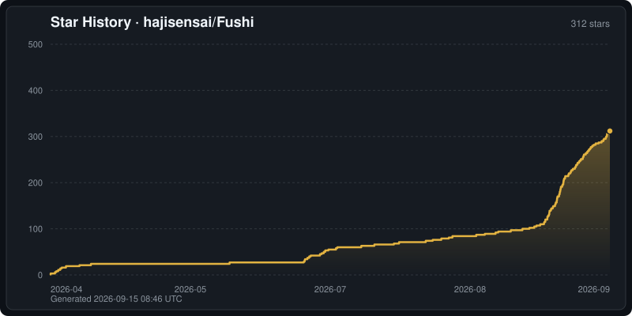

<div align="center">

# hibiki


**English** | [简体中文](README.zh-CN.md) | [繁體中文](docs/readme/README.zh-Hant.md) | [日本語](docs/readme/README.ja.md) | [한국어](docs/readme/README.ko.md) | [Español](docs/readme/README.es.md) | [Français](docs/readme/README.fr.md) | [Deutsch](docs/readme/README.de.md) | [Português](docs/readme/README.pt-BR.md) | [Русский](docs/readme/README.ru.md) | [Tiếng Việt](docs/readme/README.vi.md) | [ภาษาไทย](docs/readme/README.th.md) | [Bahasa Indonesia](docs/readme/README.id.md) | [Italiano](docs/readme/README.it.md) | [Nederlands](docs/readme/README.nl.md) | [Türkçe](docs/readme/README.tr.md) | [العربية](docs/readme/README.ar.md)

[](docs/user-guide.md)

**No fiddly setup** — import the recommended dictionaries and audio in one step.

[](https://github.com/hajisensai/hibiki/releases)
[](https://discord.gg/WhjwyGmm7f)

> **Watch what you want to watch, and pick up the language along the way.**

hibiki turns the novels you read, the shows you follow, and the audiobooks you listen to into your language input — tap any unknown word to look it up, then turn it into an Anki card with original context in one tap. It doesn't hand you a preset word list; it just helps you catch the words you **actually read and hear**.

The most effective way to learn a language is heavy exposure to real content, not memorizing isolated words from a vocabulary book. But "immersion" has always had two annoyances: looking up a word breaks your flow, and you forget it the moment you look away. hibiki closes that loop —

📖 **Read**: tap a word in the EPUB reader to look it up, without leaving the current page.<br>
🎧 **Listen**: audiobooks highlight along sentence by sentence and turn pages automatically.<br>
🎬 **Watch**: look up words and make cards right on the video subtitles — following a show *is* input.<br>
🃏 **Retain**: send any word you looked up, anywhere, straight to Anki, and review only the words you actually met.

Every scenario shares the same dictionaries, statistics, and review workflow. It works for any language (Japanese, English, …), and is especially suited to immersion learners who believe in **heavy input + only self-made cards**. Available for Android and Windows (iOS and macOS planned).

<table>
  <tr>
    <td></td>
    <td></td>
  </tr>
  <tr>
    <td colspan="2"></td>
  </tr>
  <tr>
    <td></td>
    <td></td>
  </tr>
  <tr>
    <td></td>
    <td></td>
  </tr>
</table>

**One-tap Anki mining demo**

<!-- GitHub only renders <video> tags whose src is a user-attachments uuid URL
     (uploaded via the web editor); raw repo links stay blank. Inline GIF is the
     conventional workaround. To restore a real inline player, upload the mp4 in
     the GitHub web editor and replace the img below with the generated
     https://github.com/user-attachments/assets/<uuid> video tag. -->


<sub>[Watch the HD video version ▶](https://github.com/hajisensai/hibiki/raw/main/docs/static-assets/screenshots/hibiki-readme-anki-mining-demo.mp4)</sub>

</div>

## Features

### Bookshelf

- Import EPUBs individually, in bulk, or recursively by folder; view reading progress on the shelf.
- Organize books with custom bookshelves, tag filtering, and drag-to-reorder.
- Drag-and-drop files to import books, subtitles, or videos (desktop).
- Automatically associate same-name subtitle / audio files on import.

### Reading

- Read in vertical or horizontal layout; switch between paginated and continuous-scroll modes.
- Customize themes (light / dark / pure black / custom), fonts, paragraph spacing, and reader controls.
- Furigana (ふりがな) annotations.
- Adjustable UI scale; bottom bar controls follow the scale.
- Multi-user profiles (Profile), auto-switched per book.

### Lookup

- Import [Yomitan](https://github.com/yomidevs/yomitan) (formerly Yomichan), ABBYY Lingvo (DSL), MDict (MDX), and Migaku dictionaries.
- Tap text in the reader to look up words, search on the dictionary page, or share text from other apps.
- Deinflection covering **all Yomitan transformation languages** + pre-lookup text normalization (case / diacritics / Arabic harakat), driven by code points with no language switching.
- Tap words inside definitions for recursive lookup (nested popups).
- Parallel multi-dictionary queries, sub-source priority and toggling, pitch-accent and frequency annotations.
- Online and local word audio.
- Inject custom CSS.

### Highlights & Statistics

- Add five-color highlights while reading; jump to any highlight at any time.
- Reading statistics: characters read, duration, reading speed — displayed in real time while reading.
- Video statistics: watch time, cards created, and favorites.

### Anki Card Creation

- Create cards via [AnkiDroid](https://github.com/ankidroid/Anki-Android) or AnkiConnect.
- Built-in [Lapis](https://github.com/donkuri/lapis) note type (vendored 1.7.0); create card templates and decks inside the app with one tap.
- Auto-fill context sentences; audio recording and screenshot cropping.
- Multiple export profiles (Profile) and custom field mapping.
- Favorite words; cards created and favorites are counted in statistics.

### Audiobook Sync (Sasayaki)

- SRT / LRC / VTT / ASS subtitle support; automatically aligns subtitle text to the EPUB body.
- Follow-along sentence highlighting and auto page-turning during playback.
- Playback speed, seek actions, and system media controls.
- "Play from this sentence" with seamless cross-chapter continuation.

### Video Subtitle Lookup

- Built-in video player based on [media_kit](https://github.com/media-kit/media-kit) (libmpv core).
- Embedded (text + graphic tracks) and external subtitles; .m3u8 playlist import.
- Look up words and create cards directly from subtitles during playback.
- Video library management, tag filtering, series grouping, and batch operations.

### Data Sync

- Seven sync backends: Google Drive, OneDrive, Dropbox, WebDAV, FTP, SFTP, and Hibiki P2P.
- Sync reading progress, statistics, and books.

### More

- **17 interface languages**, fully localized across all platforms.
- Share text from other apps to look up words directly.
- **Galgame voice mining** (Windows) uses an optional native voice-hook helper, distributed separately at [hajisensai/hibiki-hook](https://github.com/hajisensai/hibiki-hook).

## Platform Support

| Platform | Status | Rendering / UI |
|---|---|---|
| Android | ✅ | Material Design 3 |
| Windows | ✅ | Material |
| iOS | Planned | Cupertino |
| macOS | Planned | Material |

> Minimum Android 7.0 (API 24). The languages available for dictionary lookup are determined by the imported dictionaries and Yomitan transformation tables, independently of the interface language.

### Interface Languages (17)

English · 简体中文 · 繁體中文 · 日本語 · 한국어 · Español · Français · Deutsch · Português (Brasil) · Русский · Tiếng Việt · ภาษาไทย · Bahasa Indonesia · Italiano · Nederlands · Türkçe · العربية

## Installation

Download the latest release from [GitHub Releases](https://github.com/hajisensai/hibiki/releases) — Android APK and Windows installer are available.

<details open>
<summary>📖 <b>No fiddly setup</b> — import the recommended dictionaries and audio in one step.</summary>

<a href="docs/user-guide.md"></a>

</details>

> Requires Android 7.0 (API 24) or higher.

## Building

One-command prep (`flutter pub get` + apply patches), then build:

```bash
# From the repository root
bash tool/bootstrap.sh          # Windows PowerShell: .\tool\bootstrap.ps1

cd hibiki
# Android
flutter build apk --release --target-platform android-arm64 --split-per-abi
# Windows desktop
flutter build windows --release
```

`tool/bootstrap.sh` / `tool/bootstrap.ps1` collapse `flutter pub get` and `ci/apply-patches.sh` into a single command. This project is locked to Flutter 3.44.0 (Dart SDK `>=3.5.0 <4.0.0`); some upstream dependencies are vendored under `third_party/` or patched by `ci/apply-patches.sh` — see [docs/agent/build.md](docs/agent/build.md) for details.

<details>
<summary><b>Tech Stack</b></summary>

| Layer | Technology |
|---|---|
| Framework | Flutter 3.44.0 (Dart SDK `>=3.5.0 <4.0.0`) |
| Platforms | Android / Windows (Material Design 3) |
| Reader | WebView paging engine (derived from the Hoshi Reader family) |
| Video | media_kit (libmpv core) |
| Storage | Drift (SQLite, WAL) + hoshidicts (C++ FFI dictionary engine) |
| NLP | Yomitan transformation tables (multilingual lemmatization) + kana_kit (kana conversion); tokenization via hoshidicts FFI |
| Card Creation | AnkiDroid API + AnkiConnect |
| i18n | Slang (17 languages) |

</details>

<details>
<summary><b>Project Structure</b></summary>

```
hibiki/                      # Repository root (Melos workspace: fushi_workspace)
├── fushi/                  # Flutter app main directory
│   ├── lib/
│   │   ├── i18n/            # Internationalization (17 languages, Slang)
│   │   ├── src/
│   │   │   ├── pages/       # Pages (bookshelf, reader, dictionary, settings, etc.)
│   │   │   ├── reader/      # Reader WebView JS/CSS scripts
│   │   │   ├── media/       # Audiobook, subtitle parsing, reader source
│   │   │   └── models/      # Data models and state management (AppModel)
│   │   └── main.dart
│   └── android/             # Android project (manifest, native hoshidicts)
├── packages/                # Internal packages + flutter_inappwebview_windows (fork) + gamepads_android_stub
├── native/                  # hoshidicts C++ dictionary engine (FFI)
├── third_party/             # Vendored patched packages (dependency_overrides)
├── ci/                      # Build patches and integration test scripts
├── tool/                    # bootstrap / i18n_sync and other scripts
└── docs/                    # Development documentation (incl. docs/agent/ operations manual)
```

</details>

## Privacy & Data

hibiki stores imported books, dictionaries, fonts, audiobook data, videos, reading progress, highlights, statistics, and settings in the app's local storage.

Cloud sync (Google Drive / OneDrive / Dropbox) uses user-configured OAuth credentials; WebDAV / FTP / SFTP uses user-provided server addresses and credentials; Hibiki P2P connects directly via a user-configured address. Anki card creation communicates with AnkiDroid or a configured AnkiConnect address.

## Star History

[](https://github.com/hajisensai/hibiki/stargazers)

[](https://github.com/hajisensai/hibiki/stargazers)

> The chart above is generated inside this repository (no third-party service) and refreshed daily by the [Update Star History](.github/workflows/star-history.yml) workflow.

## Acknowledgments

hibiki builds on the following projects and ecosystem:

| Project | Description |
|---|---|
| [jidoujisho](https://github.com/arianneorpilla/jidoujisho) | Japanese immersive learning tool |
| [Hoshi Reader](https://github.com/Manhhao/Hoshi-Reader) | iOS Japanese reader; reader paging engine reference |
| [Hoshi Reader Android](https://github.com/HuangAntimony/Hoshi-Reader-Android) | Android native Japanese reader |
| [hoshidicts](https://github.com/Manhhao/hoshidicts) | C++ dictionary engine |
| [Sasayaki](https://github.com/Manhhao/Hoshi-Reader/blob/develop/SASAYAKI.md) | Audiobook sync solution |
| [Yomitan](https://github.com/yomidevs/yomitan) | Dictionary format, transformation tables, and lookup experience reference |
| [Lapis](https://github.com/donkuri/lapis) | Anki note type |
| [AnkiDroid](https://github.com/ankidroid/Anki-Android) | Android card creation integration |
| [Ankiconnect Android](https://github.com/KamWithK/AnkiconnectAndroid) | Local audio and AnkiDroid interaction reference |
| [ッツ Ebook Reader](https://github.com/ttu-ttu/ebook-reader) | Reader, statistics, and sync compatibility reference |
| [media_kit](https://github.com/media-kit/media-kit) | Flutter video playback framework (libmpv core) |
| [Niratan](https://github.com/W1ght/Niratan) | Immersion language learning suite for macOS |

## License

Distributed under the GNU General Public License v3.0. See [LICENSE](LICENSE) for details.

<div align="center">

<br>

**English** | [简体中文](README.zh-CN.md) | [繁體中文](docs/readme/README.zh-Hant.md) | [日本語](docs/readme/README.ja.md) | [한국어](docs/readme/README.ko.md) | [Español](docs/readme/README.es.md) | [Français](docs/readme/README.fr.md) | [Deutsch](docs/readme/README.de.md) | [Português](docs/readme/README.pt-BR.md) | [Русский](docs/readme/README.ru.md) | [Tiếng Việt](docs/readme/README.vi.md) | [ภาษาไทย](docs/readme/README.th.md) | [Bahasa Indonesia](docs/readme/README.id.md) | [Italiano](docs/readme/README.it.md) | [Nederlands](docs/readme/README.nl.md) | [Türkçe](docs/readme/README.tr.md) | [العربية](docs/readme/README.ar.md)

</div>
