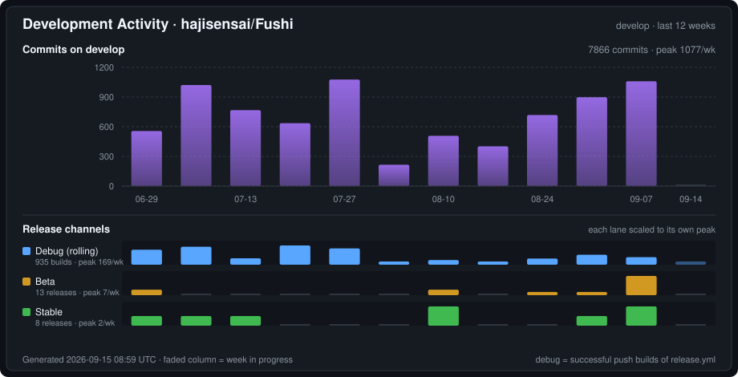

<div align="center">

# Fushi


[English](README.md) | **简体中文** | [繁體中文](docs/readme/README.zh-Hant.md) | [日本語](docs/readme/README.ja.md) | [한국어](docs/readme/README.ko.md) | [Español](docs/readme/README.es.md) | [Français](docs/readme/README.fr.md) | [Deutsch](docs/readme/README.de.md) | [Português](docs/readme/README.pt-BR.md) | [Русский](docs/readme/README.ru.md) | [Tiếng Việt](docs/readme/README.vi.md) | [ภาษาไทย](docs/readme/README.th.md) | [Bahasa Indonesia](docs/readme/README.id.md) | [Italiano](docs/readme/README.it.md) | [Nederlands](docs/readme/README.nl.md) | [Türkçe](docs/readme/README.tr.md) | [العربية](docs/readme/README.ar.md)

[](https://ncnies6wfjok.feishu.cn/wiki/OZbww3T3IiEAx5kBhHkcF07vncb)

**无需繁琐配置**，推荐词典与本地音频一键导入即用。

[](https://github.com/hajisensai/Fushi/releases)
[](https://discord.gg/WhjwyGmm7f)

> **看你想看的，语言顺手就学会了。**

Fushi 把你正在读的小说、追的番、听的有声书，变成你的语言输入——遇到生词点一下就查，查完一键做成带原文语境的 Anki 卡片。它不给你背预设词表，只帮你抓住你**真正读到、听到**的词。

学语言最有效的方式是大量接触真实内容，而不是抱着单词书背孤立的词。但“沉浸”一直有两个麻烦：看到生词查起来打断心流，查完转头就忘。Fushi 把这条链路打通了——

⬇️ **拿**：番剧、漫画在 app 内一键下载，下完自动入库，不用满世界找片源。<br>
📖 **读**：EPUB 阅读器点词即查，不跳出当前页。<br>
🎧 **听**：有声书逐句高亮跟读，自动翻页。<br>
🎬 **看**：视频字幕上直接查词、制卡，追番就是输入。<br>
🃏 **沉淀**：任意场景查到的词，一键进 Anki，只复习你真正遇到的词。

所有场景共享同一套词典、统计和复习流程。适合任何语言（日语、英语……），尤其适合信奉**大量输入 + 只背自制卡**的沉浸式学习者。面向 Android、Windows、macOS 与 iOS 四个平台发布（Linux 可自行从源码构建）。

<table>
  <tr>
    <td></td>
    <td></td>
  </tr>
  <tr>
    <td colspan="2"></td>
  </tr>
  <tr>
    <td></td>
    <td></td>
  </tr>
  <tr>
    <td></td>
    <td></td>
  </tr>
</table>

**一键制卡演示**

<!-- GitHub only renders <video> tags whose src is a user-attachments uuid URL
     (uploaded via the web editor); raw repo links stay blank. Inline GIF is the
     conventional workaround. To restore a real inline player, upload the mp4 in
     the GitHub web editor and replace the img below with the generated
     https://github.com/user-attachments/assets/<uuid> video tag. -->


<sub>[点此查看一键制卡演示 ▶](https://github.com/hajisensai/Fushi/raw/main/docs/static-assets/screenshots/fushi-readme-anki-mining-demo.mp4)</sub>
</div>

## 功能

### 书架

- 单本、批量或按文件夹递归导入 EPUB，并在书架查看阅读进度。
- 使用自定义书架整理书籍，支持标签筛选与拖拽排序。
- 拖放文件即可导入书籍、字幕或视频（桌面端）。
- 导入时自动关联同名字幕 / 音频文件。

### 阅读

- 以竖排或横排阅读书籍，并在分页和连续滚动之间切换。
- 自定义主题（明 / 暗 / 纯黑 / 自定义）、字体、段落间距和阅读器控件。
- 振假名（ふりがな）标注。
- 界面大小可调，底栏控件跟随缩放。
- 多用户配置（Profile），按书自动切换。

### 查词

- 导入 [Yomitan](https://github.com/yomidevs/yomitan)（原 Yomichan）、ABBYY Lingvo (DSL)、MDict (MDX)、Migaku 多种格式词典。
- 阅读器中点按文本查词，词典页搜索，或从其他 App 分享文本查词。
- 覆盖 Yomitan **全部变换语言**的词形还原（去屈折）+ 查词前文本归一化（大小写 / 变音符 / 阿拉伯 harakat），按码点驱动、无需切换语言。
- 点击释义中的生词进行递归查询（嵌套弹窗）。
- 多词典并行查询、子来源优先级与启停、音调标注与词频。
- 使用在线或本地单词音频。
- 注入自定义 CSS 样式。

### 标注与统计

- 阅读时添加五色高亮标注，并随时跳转。
- 阅读数据统计：字符数、时长、阅读速度，可在阅读时实时显示。
- 视频统计：观看时长、制卡与收藏数量。

### Anki 制卡

- 通过 [AnkiDroid](https://github.com/ankidroid/Anki-Android) 或 AnkiConnect 制卡。
- 内置 [Lapis](https://github.com/donkuri/lapis) 笔记类型（vendored 1.7.0），可在 App 内一键创建卡片模板与牌组。
- 自动填充上下文句子，支持录音与截图裁剪。
- 多导出配置（Profile）、自定义字段映射。
- 收藏生词，制卡与收藏计入统计。

### 有声书跟读（Sasayaki）

- 支持 SRT / LRC / VTT / ASS 字幕，自动将字幕文本对齐到 EPUB 正文。
- 播放时正文逐句高亮，自动翻页。
- 控制播放速度、跳转动作和系统媒体控制。
- 「从本句播放」跨章节无缝衔接。

### 视频字幕查词

- 内置基于 [media_kit](https://github.com/media-kit/media-kit)（libmpv 内核）的视频播放器。
- 支持内嵌（文本轨 + 图形轨）和外挂字幕，.m3u8 播放列表导入。
- 播放视频时直接在字幕上查词、制卡，把影视素材也纳入沉浸式输入。
- 视频库管理、标签筛选、系列分组与批量操作。

### 数据同步

- 支持 Google Drive、OneDrive、Dropbox、WebDAV、FTP、SFTP 和 Fushi Interconnect 七种同步后端。
- 同步阅读进度、统计和书籍。
- **Fushi 互联**在局域网内把你自己的设备直接配对，中间不经过任何云账号：一台做主机，另一台远程读它的库，制卡还能委托给主机端的 Anki。

### 漫画

- 漫画与其他格式并列管理，支持分页与条漫两种阅读模式。
- 直接在画面上 OCR 查词，可用内置引擎或外接 mokuro。

### 下载

- **片源本身也能一键拿到**：不用离开 app，按 AniList / Nyaa 搜番，单集、合集或整季一键下载，有字幕的自动附带。
- 下完自动入库，而且**不用等下完——可以边下边播**。
- **漫画**：浏览在线目录，勾上要的卷，自动下载、解包、上架。
- 也可以直接粘贴磁力链接，把书或视频拉下来。
- 「**下载并订阅**」之后新集自动下载（Fushi 运行期间每 15 分钟检查一次），配放送日历看下一集什么时候来。
- 内置 torrent 引擎（libtorrent），不用另装客户端；原生库缺失时回退外接 qBittorrent。
- 下载页统一跟踪任务与订阅；重命名和移动都走下载引擎，做种不会被打断。

### Galgame 语音制卡（Windows）

- Hook 正在运行的游戏，抓当前文本**和它对应的原始语音**，两者一起进卡。
- 独立的游戏库与分作品统计。
- 语音 Hook 的 native 组件就在本仓（`native/galgame_hook/`），与本体同一次构建产出、随安装包落地，运行期不下载任何组件。

### 更多

- **17 种界面语言**，全平台本地化。
- 从其他应用分享文本直接查词。
- 移动端与桌面端均支持 app 外划词查词，另有浏览器扩展。

## 平台支持

| 平台 | 状态 | 渲染 / UI |
|---|---|---|
| Android | ✅ | Material Design 3 |
| Windows | ✅ | Material Design 3 |
| macOS | ✅ | Material Design 3 |
| Linux | 🔧 (build from source) | Material Design 3 |
| iOS | ✅ | Material Design 3 |

> 最低 Android 7.0（API 24）。Galgame 语音制卡仅限 Windows。词典查词的语言由导入的词典与 Yomitan 变换表决定，与界面语言相互独立。

### 界面语言（17 种）

English · 简体中文 · 繁體中文 · 日本語 · 한국어 · Español · Français · Deutsch · Português (Brasil) · Русский · Tiếng Việt · ภาษาไทย · Bahasa Indonesia · Italiano · Nederlands · Türkçe · العربية

## 安装

从 [GitHub Releases](https://github.com/hajisensai/Fushi/releases) 下载最新版本，提供 Android APK、Windows 安装包，以及 macOS、iOS 构建。Linux 暂无预编译包，需自行从源码构建。

<details open>
<summary>📖 <b>无需繁琐配置</b>：推荐词典与本地音频一键导入即用。</summary>

<a href="https://ncnies6wfjok.feishu.cn/wiki/OZbww3T3IiEAx5kBhHkcF07vncb"></a>

</details>

> 最低 Android 7.0（API 24）。

## 构建

一键准备（`flutter pub get` + 打补丁），然后构建：

```bash
# 在仓库根目录
bash tool/bootstrap.sh          # Windows PowerShell：.\tool\bootstrap.ps1

cd fushi
# Android
flutter build apk --release --target-platform android-arm64 --split-per-abi
# 桌面
flutter build windows --release
flutter build macos --release
flutter build linux --release
# iOS
flutter build ipa --release
```

`tool/bootstrap.sh` / `tool/bootstrap.ps1` 把 `flutter pub get` 与 `ci/apply-patches.sh` 收敛成一条命令。本项目锁定 Flutter 3.44.0（Dart SDK `>=3.5.0 <4.0.0`），部分上游依赖经 vendored 到 `third_party/` 或由 `ci/apply-patches.sh` 修补——机制细节见 [docs/agent/build.md](docs/agent/build.md)。

<details>
<summary><b>技术栈一览</b></summary>

| 层 | 技术 |
|---|---|
| 框架 | Flutter 3.44.0（Dart SDK `>=3.5.0 <4.0.0`） |
| 平台 | Android / Windows / macOS / iOS（Material Design 3） |
| 阅读器 | WebView 分页引擎（衍生自 Hoshi Reader 系列） |
| 视频 | media_kit（libmpv 内核） |
| 存储 | Drift（SQLite，WAL）+ fushidicts（C++ FFI 词典引擎） |
| NLP | Yomitan 变换表（多语言词形还原）+ kana_kit（假名转换）；分词走 fushidicts FFI |
| 下载 | libtorrent 2.x（C ABI FFI 桥） |
| 制卡 | AnkiDroid API + AnkiConnect |
| 国际化 | Slang（17 种语言） |

</details>

<details>
<summary><b>项目结构</b></summary>

```
Fushi/                      # 仓库根（Melos workspace: fushi_workspace）
├── fushi/                  # Flutter 应用主目录
│   ├── lib/
│   │   ├── i18n/            # 国际化（17 种语言，Slang）
│   │   ├── src/
│   │   │   ├── pages/       # 页面（书架、阅读器、词典、设置等）
│   │   │   ├── reader/      # 阅读器 WebView JS/CSS 脚本
│   │   │   ├── media/       # 有声书、字幕解析、reader source
│   │   │   └── models/      # 数据模型与状态管理（AppModel）
│   │   └── main.dart
│   └── android/             # Android 工程（manifest、native fushidicts）
├── packages/                # 内部 package + flutter_inappwebview_windows(fork) + gamepads_android_stub
├── native/                  # C++ 源码：fushidicts（词典引擎）、fushi_torrent、galgame_hook
├── third_party/             # vendored 补丁包（dependency_overrides 指向）
├── ci/                      # 构建补丁与集成测试脚本
├── tool/                    # bootstrap / i18n_sync 等脚本
└── docs/                    # 开发文档（含 docs/agent/ agent 操作手册）
```

</details>

## 隐私与数据

Fushi 将导入的书籍、词典、字体、有声书数据、视频、阅读进度、高亮、统计和设置保存在 App 本地存储中。

云同步（Google Drive / OneDrive / Dropbox）使用由用户配置的 OAuth 凭据；WebDAV / FTP / SFTP 使用用户提供的服务器地址与凭据；Fushi Interconnect 通过用户配置的地址直连。Anki 制卡会与 AnkiDroid 或已配置的 AnkiConnect 地址通信。

## 开发活跃度

[](https://github.com/hajisensai/Fushi/commits/develop)

日常开发都提交在 `develop`，`main` 只接收发布合并。上图虽然显示在 `main` 上，数据取自 `develop`，所以反映的是真实开发量，而不是合并流水。

下方三条泳道就是 App 内提供的三个更新通道，每条按各自峰值缩放——debug 构建数比正式版高两个数量级，用同一把标尺会把后两条压成看不见。

| 泳道 | 统计对象 | 获取方式 |
|---|---|---|
| **Debug（滚动）** | [release.yml](.github/workflows/release.yml) 中成功的 push 构建 | 滚动预发布，每次 push 覆盖重发 |
| **Beta** | `v<版本>-beta.<seq>` 预发布 | 手动触发的测试版 |
| **Stable** | `v<版本>` 正式发布 | 正式版（Latest） |

> 上图由本仓库内的脚本自动生成（不依赖任何第三方服务），并由 [Update Dev Activity Chart](.github/workflows/dev-activity.yml) 工作流每日刷新。

## Star 趋势

[](https://github.com/hajisensai/Fushi/stargazers)

[](https://github.com/hajisensai/Fushi/stargazers)

> 上图由本仓库内的脚本自动生成（不依赖任何第三方服务），并由 [Update Star History](.github/workflows/star-history.yml) 工作流每日刷新。

## 鸣谢

Fushi 基于以下项目与生态：

| 项目 | 说明 |
|---|---|
| [jidoujisho](https://github.com/arianneorpilla/jidoujisho) | 日语沉浸式学习工具 |
| [Hoshi Reader](https://github.com/Manhhao/Hoshi-Reader) | iOS 日语阅读器，阅读器分页引擎参考 |
| [Hoshi Reader Android](https://github.com/HuangAntimony/Hoshi-Reader-Android) | Android 原生日语阅读器 |
| [hoshidicts](https://github.com/Manhhao/hoshidicts) | C++ 词典引擎 |
| [Sasayaki](https://github.com/Manhhao/Hoshi-Reader/blob/develop/SASAYAKI.md) | 有声书同步方案 |
| [Yomitan](https://github.com/yomidevs/yomitan) | 词典格式、变换表与查词体验参考 |
| [Lapis](https://github.com/donkuri/lapis) | Anki 笔记类型 |
| [AnkiDroid](https://github.com/ankidroid/Anki-Android) | Android 制卡集成 |
| [Ankiconnect Android](https://github.com/KamWithK/AnkiconnectAndroid) | 本地音频与 AnkiDroid 交互参考 |
| [ッツ Ebook Reader](https://github.com/ttu-ttu/ebook-reader) | 阅读器、统计与同步兼容性参考 |
| [media_kit](https://github.com/media-kit/media-kit) | Flutter 视频播放框架（libmpv 内核） |
| [Niratan](https://github.com/W1ght/Niratan) | macOS 沉浸式语言学习套件 |

## 许可证

本项目基于 GNU General Public License v3.0 发布。详情见 [LICENSE](LICENSE)。

<div align="center">

<br>

[English](README.md) | **简体中文** | [繁體中文](docs/readme/README.zh-Hant.md) | [日本語](docs/readme/README.ja.md) | [한국어](docs/readme/README.ko.md) | [Español](docs/readme/README.es.md) | [Français](docs/readme/README.fr.md) | [Deutsch](docs/readme/README.de.md) | [Português](docs/readme/README.pt-BR.md) | [Русский](docs/readme/README.ru.md) | [Tiếng Việt](docs/readme/README.vi.md) | [ภาษาไทย](docs/readme/README.th.md) | [Bahasa Indonesia](docs/readme/README.id.md) | [Italiano](docs/readme/README.it.md) | [Nederlands](docs/readme/README.nl.md) | [Türkçe](docs/readme/README.tr.md) | [العربية](docs/readme/README.ar.md)

</div>
