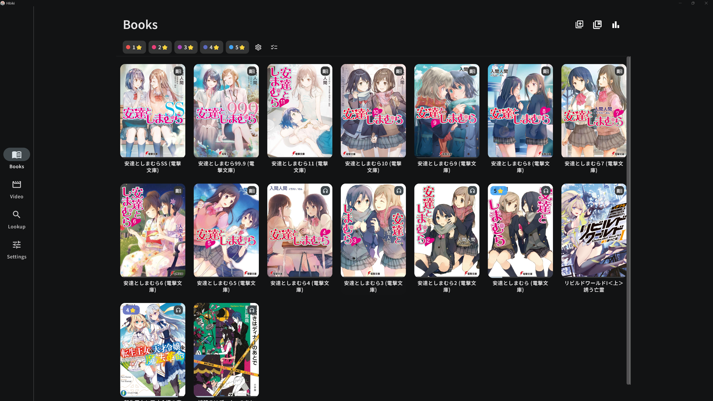
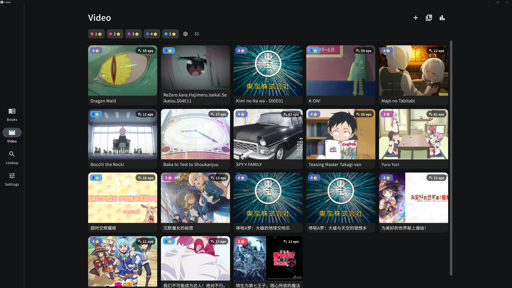
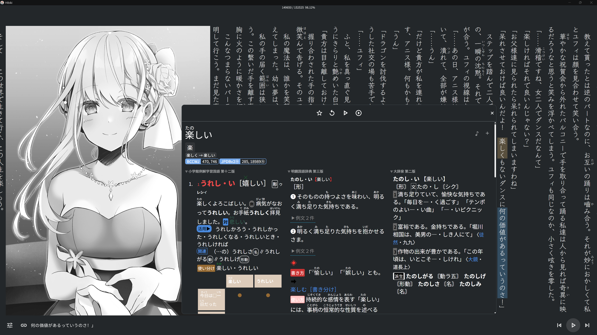
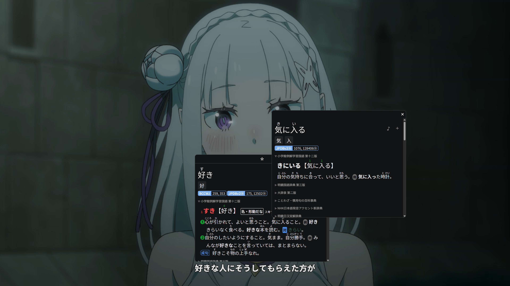
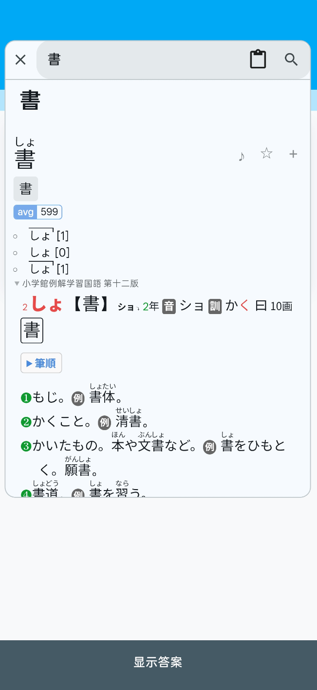
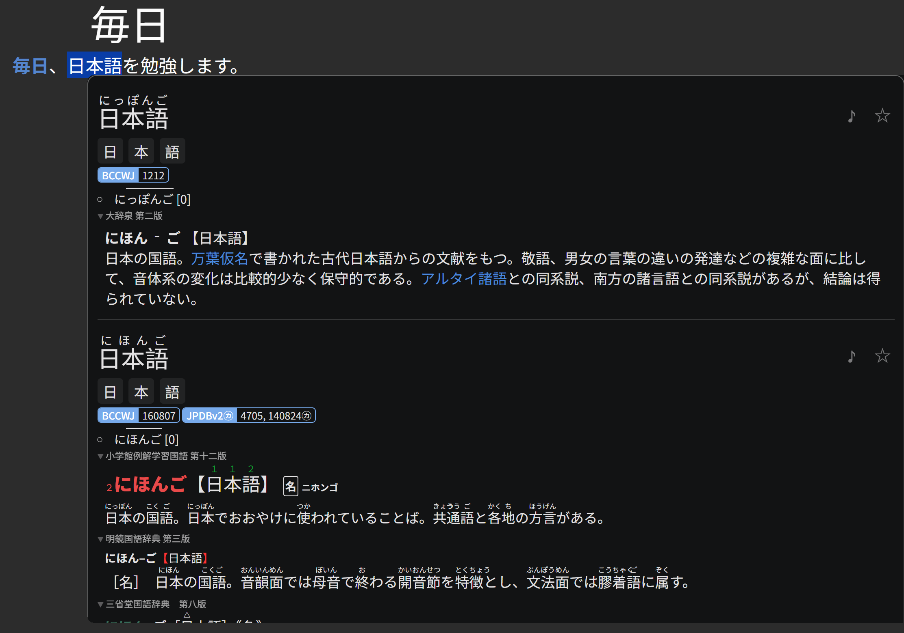
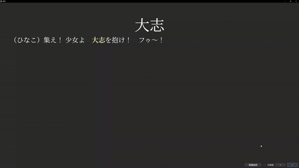

<div align="center">

# Fushi


[简体中文](../../README.zh-CN.md) | [English](../../README.md) | [繁體中文](README.zh-Hant.md) | [日本語](README.ja.md) | [한국어](README.ko.md) | [Español](README.es.md) | [Français](README.fr.md) | [Deutsch](README.de.md) | [Português](README.pt-BR.md) | [Русский](README.ru.md) | [Tiếng Việt](README.vi.md) | [ภาษาไทย](README.th.md) | [Bahasa Indonesia](README.id.md) | [Italiano](README.it.md) | **Nederlands** | [Türkçe](README.tr.md) | [العربية](README.ar.md)

[](../user-guide.nl.md)

**Geen omslachtige configuratie** — importeer de aanbevolen woordenboeken en audio in één stap.

[](https://github.com/hajisensai/Fushi/releases)
[](https://discord.gg/WhjwyGmm7f)

> **Kijk waar je zin in hebt en pik de taal onderweg op.**

Fushi maakt van de romans die je leest, de series die je volgt en de audioboeken die je luistert jouw taalinput: tik op elk onbekend woord om het op te zoeken en maak er met één tik een Anki-kaart met originele context van. Het laat je geen vooraf samengestelde woordenlijst stampen, maar helpt je juist de woorden te grijpen die je **echt leest en hoort**.

De effectiefste manier om een taal te leren is veelvuldige blootstelling aan echte content, niet het uit je hoofd leren van losse woorden uit een woordenboekje. Maar "onderdompeling" had altijd twee ergernissen: een woord opzoeken onderbreekt je flow, en je vergeet het zodra je wegkijkt. Fushi sluit die cirkel:

📖 **Lezen**: tik op een woord in de EPUB-lezer om het op te zoeken, zonder de huidige pagina te verlaten.<br>
🎧 **Luisteren**: audioboeken markeren zin voor zin mee en slaan automatisch de pagina om.<br>
🎬 **Kijken**: zoek woorden op en maak kaarten direct in de video-ondertitels — een serie volgen *is* input.<br>
🃏 **Vastleggen**: stuur elk opgezocht woord, in welke situatie dan ook, rechtstreeks naar Anki en herhaal alleen de woorden die je echt bent tegengekomen.

Alle situaties delen dezelfde woordenboeken, statistieken en herhalingsworkflow. Geschikt voor elke taal (Japans, Engels, …) en vooral voor onderdompelingsleerders die geloven in **veel input + alleen zelfgemaakte kaarten**. Beschikbaar voor Android en Windows (iOS en macOS gepland).

<table>
  <tr>
    <td></td>
    <td></td>
  </tr>
  <tr>
    <td colspan="2"></td>
  </tr>
  <tr>
    <td></td>
    <td></td>
  </tr>
  <tr>
    <td></td>
    <td></td>
  </tr>
</table>

**Demo: Anki-kaarten maken met één tik**

<!-- GitHub only renders <video> tags whose src is a user-attachments uuid URL
     (uploaded via the web editor); raw repo links stay blank. Inline GIF is the
     conventional workaround. To restore a real inline player, upload the mp4 in
     the GitHub web editor and replace the img below with the generated
     https://github.com/user-attachments/assets/<uuid> video tag. -->


<sub>[Bekijk de demo voor het maken van kaarten met één klik ▶](https://github.com/hajisensai/Fushi/raw/main/docs/static-assets/screenshots/fushi-readme-anki-mining-demo.mp4)</sub>
</div>

## Functies

### Boekenplank

- Importeer EPUB's afzonderlijk, in bulk of recursief per map; bekijk de leesvoortgang direct op de plank.
- Organiseer boeken met aangepaste boekenplanken, tagfilters en slepen om te herordenen.
- Sleep bestanden om boeken, ondertitels of video's te importeren (desktop).
- Koppel bij het importeren automatisch ondertitel-/audiobestanden met dezelfde naam.

### Lezen

- Lees in verticale of horizontale lay-out; schakel tussen pagina- en doorlopende-scrollmodus.
- Pas thema's (licht / donker / puur zwart / aangepast), lettertypen, alinea-afstand en lezerbediening aan.
- Furigana (ふりがな)-annotaties.
- Aanpasbare UI-schaal; de bedieningselementen van de onderbalk volgen de schaal.
- Profielen voor meerdere gebruikers (Profile), automatisch per boek gewisseld.

### Opzoeken

- Importeer woordenboeken van [Yomitan](https://github.com/yomidevs/yomitan) (voorheen Yomichan), ABBYY Lingvo (DSL), MDict (MDX) en Migaku.
- Tik op tekst in de lezer om woorden op te zoeken, zoek op de woordenboekpagina of deel tekst vanuit andere apps.
- Deflexie voor **alle Yomitan-transformatietalen** + tekstnormalisatie vóór het opzoeken (hoofdletters / diakritische tekens / Arabische harakat), aangestuurd door code points zonder taalwisseling.
- Tik op woorden binnen definities voor recursief opzoeken (geneste pop-ups).
- Parallelle zoekopdrachten in meerdere woordenboeken, prioriteit en in-/uitschakelen van subbronnen, toonhoogteaccent- en frequentie-annotaties.
- Online en lokale woord-audio.
- Eigen CSS injecteren.

### Markeringen & Statistieken

- Voeg tijdens het lezen markeringen in vijf kleuren toe; spring op elk moment naar elke markering.
- Leesstatistieken: gelezen tekens, duur, leessnelheid — in realtime weergegeven tijdens het lezen.
- Videostatistieken: kijktijd, gemaakte kaarten en favorieten.

### Anki-kaarten maken

- Maak kaarten via [AnkiDroid](https://github.com/ankidroid/Anki-Android) of AnkiConnect.
- Ingebouwd [Lapis](https://github.com/donkuri/lapis)-notitietype (meegeleverd 1.7.0); maak kaartsjablonen en decks met één tik binnen de app.
- Vul contextzinnen automatisch in; audio-opname en screenshot-bijsnijden.
- Meerdere exportprofielen (Profile) en aangepaste veldtoewijzing.
- Markeer woorden als favoriet; gemaakte kaarten en favorieten worden meegeteld in de statistieken.

### Audioboeksynchronisatie (Sasayaki)

- Ondersteuning voor SRT-/LRC-/VTT-/ASS-ondertitels; lijnt de ondertiteltekst automatisch uit met de EPUB-tekst.
- Meelopende zinmarkering en automatisch omslaan van pagina's tijdens het afspelen.
- Afspeelsnelheid, zoekacties en systeemmediabediening.
- „Afspelen vanaf deze zin” met naadloze voortzetting over hoofdstukken heen.

### Woorden opzoeken in videoondertitels

- Ingebouwde videospeler op basis van [media_kit](https://github.com/media-kit/media-kit) (libmpv-kern).
- Ingebedde (tekst- + grafische sporen) en externe ondertitels; import van .m3u8-afspeellijsten.
- Zoek tijdens het afspelen woorden op en maak kaarten rechtstreeks vanuit de ondertitels.
- Beheer van de videobibliotheek, tagfilters, seriegroepering en bulkbewerkingen.

### Gegevenssynchronisatie

- Zeven sync-backends: Google Drive, OneDrive, Dropbox, WebDAV, FTP, SFTP en Fushi Interconnect.
- Synchroniseer leesvoortgang, statistieken en boeken.

### Meer

- **17 interfacetalen**, volledig gelokaliseerd op alle platforms.
- Deel tekst vanuit andere apps om woorden direct op te zoeken.

## Platformondersteuning

| Platform | Status | Rendering / UI |
|---|---|---|
| Android | ✅ | Material Design 3 |
| Windows | ✅ | Material Design 3 |
| macOS | ✅ | Material Design 3 |
| Linux | 🔧 (build from source) | Material Design 3 |
| iOS | ✅ | Material Design 3 |

> Minimaal Android 7.0 (API 24). Welke talen beschikbaar zijn om op te zoeken, wordt bepaald door de geïmporteerde woordenboeken en de Yomitan-transformatietabellen, onafhankelijk van de interfacetaal.

### Interfacetalen (17)

English · 简体中文 · 繁體中文 · 日本語 · 한국어 · Español · Français · Deutsch · Português (Brasil) · Русский · Tiếng Việt · ภาษาไทย · Bahasa Indonesia · Italiano · Nederlands · Türkçe · العربية

## Installatie & Bouwen

Voorbereiding met één commando (`flutter pub get` + patches toepassen), dan bouwen:

```bash
# Vanuit de hoofdmap van de repository
bash tool/bootstrap.sh          # Windows PowerShell: .\tool\bootstrap.ps1

cd fushi
# Android
flutter build apk --release --target-platform android-arm64 --split-per-abi
# Windows-desktop
flutter build windows --release
```

`tool/bootstrap.sh` / `tool/bootstrap.ps1` bundelen `flutter pub get` en `ci/apply-patches.sh` tot één enkel commando. Dit project is vastgezet op Flutter 3.44.0 (Dart SDK `>=3.5.0 <4.0.0`); sommige upstream-afhankelijkheden zijn meegeleverd onder `third_party/` of gepatcht door `ci/apply-patches.sh` — zie [docs/agent/build.md](../agent/build.md) voor details.

<details>
<summary><b>Technologiestack</b></summary>

| Laag | Technologie |
|---|---|
| Framework | Flutter 3.44.0 (Dart SDK `>=3.5.0 <4.0.0`) |
| Platforms | Android / Windows / macOS / iOS (Material Design 3) |
| Reader | WebView-paginamotor (afgeleid van de Hoshi Reader-familie) |
| Video | media_kit (libmpv-kern) |
| Opslag | Drift (SQLite, WAL) + fushidicts (C++-FFI-woordenboekengine) |
| NLP | Yomitan-transformatietabellen (meertalige lemmatisering) + kana_kit (kana-conversie); tokenisatie via fushidicts-FFI |
| Kaarten maken | AnkiDroid API + AnkiConnect |
| i18n | Slang (17 talen) |

</details>

<details>
<summary><b>Projectstructuur</b></summary>

```
Fushi/                      # Hoofdmap van de repository (Melos-workspace: fushi_workspace)
├── fushi/                  # Hoofdmap van de Flutter-app
│   ├── lib/
│   │   ├── i18n/            # Internationalisatie (17 talen, Slang)
│   │   ├── src/
│   │   │   ├── pages/       # Pagina's (boekenplank, lezer, woordenboek, instellingen enz.)
│   │   │   ├── reader/      # Reader-WebView-JS-/CSS-scripts
│   │   │   ├── media/       # Audioboek, ondertitel-parsing, reader-bron
│   │   │   └── models/      # Datamodellen en toestandsbeheer (AppModel)
│   │   └── main.dart
│   └── android/             # Android-project (manifest, native fushidicts)
├── packages/                # Interne pakketten + flutter_inappwebview_windows (fork) + gamepads_android_stub
├── native/                  # fushidicts C++-woordenboekengine (FFI)
├── third_party/             # Meegeleverde gepatchte pakketten (dependency_overrides)
├── ci/                      # Build-patches en integratietestscripts
├── tool/                    # bootstrap / i18n_sync en andere scripts
└── docs/                    # Ontwikkeldocumentatie (incl. docs/agent/ bedieningshandleiding)
```

</details>

## Privacy & Gegevens

Fushi slaat geïmporteerde boeken, woordenboeken, lettertypen, audioboekgegevens, video's, leesvoortgang, markeringen, statistieken en instellingen op in de lokale opslag van de app.

Cloud-synchronisatie (Google Drive / OneDrive / Dropbox) gebruikt door de gebruiker geconfigureerde OAuth-referenties; WebDAV / FTP / SFTP gebruikt door de gebruiker opgegeven serveradressen en referenties; Fushi Interconnect verbindt rechtstreeks via een door de gebruiker geconfigureerd adres. Het maken van Anki-kaarten communiceert met AnkiDroid of een geconfigureerd AnkiConnect-adres.

## Dankbetuigingen

Fushi bouwt voort op de volgende projecten en het volgende ecosysteem:

| Project | Beschrijving |
|---|---|
| [jidoujisho](https://github.com/arianneorpilla/jidoujisho) | Japanse immersieve leertool |
| [Hoshi Reader](https://github.com/Manhhao/Hoshi-Reader) | iOS-Japanse lezer; referentie voor de reader-paginamotor |
| [Hoshi Reader Android](https://github.com/HuangAntimony/Hoshi-Reader-Android) | Native Japanse lezer voor Android |
| [hoshidicts](https://github.com/Manhhao/hoshidicts) | C++-woordenboekengine |
| [Sasayaki](https://github.com/Manhhao/Hoshi-Reader/blob/develop/SASAYAKI.md) | Oplossing voor audioboeksynchronisatie |
| [Yomitan](https://github.com/yomidevs/yomitan) | Referentie voor woordenboekformaat, transformatietabellen en opzoekervaring |
| [Lapis](https://github.com/donkuri/lapis) | Anki-notitietype |
| [AnkiDroid](https://github.com/ankidroid/Anki-Android) | Android-integratie voor kaarten maken |
| [Ankiconnect Android](https://github.com/KamWithK/AnkiconnectAndroid) | Referentie voor lokale audio en AnkiDroid-interactie |
| [ッツ Ebook Reader](https://github.com/ttu-ttu/ebook-reader) | Referentie voor lezer, statistieken en sync-compatibiliteit |
| [media_kit](https://github.com/media-kit/media-kit) | Flutter-videoweergaveframework (libmpv-kern) |
| [Niratan](https://github.com/W1ght/Niratan) | Immersieve taalleersuite voor macOS |

## Licentie

Gedistribueerd onder de GNU General Public License v3.0. Zie [LICENSE](../../LICENSE) voor details.

<div align="center">

<br>

[简体中文](../../README.zh-CN.md) | [English](../../README.md) | [繁體中文](README.zh-Hant.md) | [日本語](README.ja.md) | [한국어](README.ko.md) | [Español](README.es.md) | [Français](README.fr.md) | [Deutsch](README.de.md) | [Português](README.pt-BR.md) | [Русский](README.ru.md) | [Tiếng Việt](README.vi.md) | [ภาษาไทย](README.th.md) | [Bahasa Indonesia](README.id.md) | [Italiano](README.it.md) | **Nederlands** | [Türkçe](README.tr.md) | [العربية](README.ar.md)

</div>
