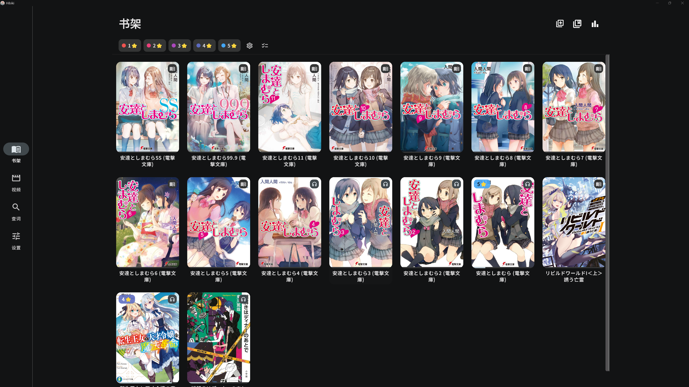
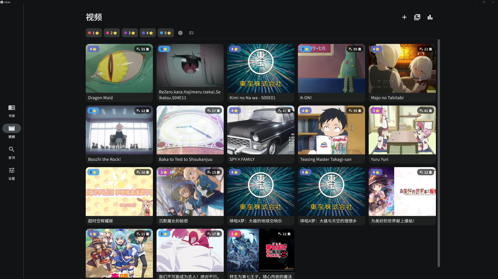

<div align="center">

# Fushi


[简体中文](../../README.zh-CN.md) | [English](../../README.md) | **繁體中文** | [日本語](README.ja.md) | [한국어](README.ko.md) | [Español](README.es.md) | [Français](README.fr.md) | [Deutsch](README.de.md) | [Português](README.pt-BR.md) | [Русский](README.ru.md) | [Tiếng Việt](README.vi.md) | [ภาษาไทย](README.th.md) | [Bahasa Indonesia](README.id.md) | [Italiano](README.it.md) | [Nederlands](README.nl.md) | [Türkçe](README.tr.md) | [العربية](README.ar.md)

[](../user-guide.zh-Hant.md)

**無需繁瑣設定**，推薦詞典與本機音訊一鍵匯入即用。

[](https://github.com/hajisensai/Fushi/releases)
[](https://discord.gg/WhjwyGmm7f)

> **看你想看的，語言順手就學會了。**

Fushi 把你正在讀的小說、追的番、聽的有聲書，變成你的語言輸入——遇到生詞點一下就查，查完一鍵做成帶原文語境的 Anki 卡片。它不給你背預設詞表，只幫你抓住你**真正讀到、聽到**的詞。

學語言最有效的方式是大量接觸真實內容，而不是抱著單字書背孤立的詞。但「沉浸」一直有兩個麻煩：看到生詞查起來打斷心流，查完轉頭就忘。Fushi 把這條鏈路打通了——

📖 **讀**：EPUB 閱讀器點詞即查，不跳出當前頁。<br>
🎧 **聽**：有聲書逐句高亮跟讀，自動翻頁。<br>
🎬 **看**：影片字幕上直接查詞、製卡，追番就是輸入。<br>
🃏 **沉澱**：任意場景查到的詞，一鍵進 Anki，只複習你真正遇到的詞。

所有場景共用同一套詞典、統計和複習流程。適合任何語言（日語、英語……），尤其適合信奉**大量輸入 + 只背自製卡**的沉浸式學習者。面向 Android 與 Windows（iOS、macOS 計劃中）。

<table>
  <tr>
    <td></td>
    <td></td>
  </tr>
  <tr>
    <td colspan="2"></td>
  </tr>
  <tr>
    <td></td>
    <td></td>
  </tr>
  <tr>
    <td></td>
    <td></td>
  </tr>
</table>

**一鍵製卡演示**

<!-- GitHub only renders <video> tags whose src is a user-attachments uuid URL
     (uploaded via the web editor); raw repo links stay blank. Inline GIF is the
     conventional workaround. To restore a real inline player, upload the mp4 in
     the GitHub web editor and replace the img below with the generated
     https://github.com/user-attachments/assets/<uuid> video tag. -->


<sub>[點此查看一鍵製卡示範 ▶](https://github.com/hajisensai/Fushi/raw/main/docs/static-assets/screenshots/fushi-readme-anki-mining-demo.mp4)</sub>
</div>

## 功能

### 書架

- 單本、批次或按資料夾遞迴匯入 EPUB，並在書架檢視閱讀進度。
- 使用自訂書架整理書籍，支援標籤篩選與拖曳排序。
- 拖放檔案即可匯入書籍、字幕或影片（桌面端）。
- 匯入時自動關聯同名字幕 / 音訊檔案。

### 閱讀

- 以直排或橫排閱讀書籍，並在分頁和連續捲動之間切換。
- 自訂主題（明 / 暗 / 純黑 / 自訂）、字型、段落間距和閱讀器控制項。
- 振假名（ふりがな）標注。
- 介面大小可調，底列控制項跟隨縮放。
- 多使用者設定檔（Profile），按書自動切換。

### 查詞

- 匯入 [Yomitan](https://github.com/yomidevs/yomitan)（原 Yomichan）、ABBYY Lingvo (DSL)、MDict (MDX)、Migaku 多種格式詞典。
- 閱讀器中點按文字查詞，詞典頁搜尋，或從其他 App 分享文字查詞。
- 涵蓋 Yomitan **全部變換語言**的詞形還原（去屈折）+ 查詞前文字正規化（大小寫 / 變音符 / 阿拉伯 harakat），按碼點驅動、無需切換語言。
- 點擊釋義中的生詞進行遞迴查詢（巢狀彈窗）。
- 多詞典並行查詢、子來源優先級與啟停、音調標注與詞頻。
- 使用線上或本機單詞音訊。
- 注入自訂 CSS 樣式。

### 標注與統計

- 閱讀時新增五色高亮標注，並隨時跳轉。
- 閱讀資料統計：字元數、時長、閱讀速度，可在閱讀時即時顯示。
- 影片統計：觀看時長、製卡與收藏數量。

### Anki 製卡

- 透過 [AnkiDroid](https://github.com/ankidroid/Anki-Android) 或 AnkiConnect 製卡。
- 內建 [Lapis](https://github.com/donkuri/lapis) 筆記類型（vendored 1.7.0），可在 App 內一鍵建立卡片範本與牌組。
- 自動填充上下文句子，支援錄音與截圖裁剪。
- 多匯出設定檔（Profile）、自訂欄位對映。
- 收藏生詞，製卡與收藏計入統計。

### 有聲書跟讀（Sasayaki）

- 支援 SRT / LRC / VTT / ASS 字幕，自動將字幕文字對齊到 EPUB 正文。
- 播放時正文逐句高亮，自動翻頁。
- 控制播放速度、跳轉動作和系統媒體控制。
- 「從本句播放」跨章節無縫銜接。

### 影片字幕查詞

- 內建基於 [media_kit](https://github.com/media-kit/media-kit)（libmpv 核心）的影片播放器。
- 支援內嵌（文字軌 + 圖形軌）和外掛字幕，.m3u8 播放清單匯入。
- 播放影片時直接在字幕上查詞、製卡，把影視素材也納入沉浸式輸入。
- 影片庫管理、標籤篩選、系列分組與批次操作。

### 資料同步

- 支援 Google Drive、OneDrive、Dropbox、WebDAV、FTP、SFTP 和 Fushi Interconnect 七種同步後端。
- 同步閱讀進度、統計和書籍。

### 更多

- **17 種介面語言**，全平台在地化。
- 從其他應用程式分享文字直接查詞。

## 平台支援

| 平台 | 狀態 | 渲染 / UI |
|---|---|---|
| Android | ✅ | Material Design 3 |
| Windows | ✅ | Material Design 3 |
| macOS | ✅ | Material Design 3 |
| Linux | 🔧 (build from source) | Material Design 3 |
| iOS | ✅ | Material Design 3 |

> 最低 Android 7.0（API 24）。詞典查詞的語言由匯入的詞典與 Yomitan 變換表決定，與介面語言相互獨立。

### 介面語言（17 種）

English · 简体中文 · 繁體中文 · 日本語 · 한국어 · Español · Français · Deutsch · Português (Brasil) · Русский · Tiếng Việt · ภาษาไทย · Bahasa Indonesia · Italiano · Nederlands · Türkçe · العربية

## 安裝

從 [GitHub Releases](https://github.com/hajisensai/Fushi/releases) 下載最新版本，支援 Android APK 和 Windows 安裝包。

> 最低 Android 7.0（API 24）。

## 建置

一鍵準備（`flutter pub get` + 打補丁），然後建置：

```bash
# 在倉庫根目錄
bash tool/bootstrap.sh          # Windows PowerShell：.\tool\bootstrap.ps1

cd fushi
# Android
flutter build apk --release --target-platform android-arm64 --split-per-abi
# Windows 桌面
flutter build windows --release
```

`tool/bootstrap.sh` / `tool/bootstrap.ps1` 把 `flutter pub get` 與 `ci/apply-patches.sh` 收斂成一條命令。本專案鎖定 Flutter 3.44.0（Dart SDK `>=3.5.0 <4.0.0`），部分上游依賴經 vendored 到 `third_party/` 或由 `ci/apply-patches.sh` 修補——機制細節見 [docs/agent/build.md](../agent/build.md)。

<details>
<summary><b>技術棧一覽</b></summary>

| 層 | 技術 |
|---|---|
| 框架 | Flutter 3.44.0（Dart SDK `>=3.5.0 <4.0.0`） |
| 平台 | Android / Windows / macOS / iOS（Material Design 3） |
| 閱讀器 | WebView 分頁引擎（衍生自 Hoshi Reader 系列） |
| 影片 | media_kit（libmpv 核心） |
| 儲存 | Drift（SQLite，WAL）+ fushidicts（C++ FFI 詞典引擎） |
| NLP | Yomitan 變換表（多語言詞形還原）+ kana_kit（假名轉換）；分詞走 fushidicts FFI |
| 製卡 | AnkiDroid API + AnkiConnect |
| 國際化 | Slang（17 種語言） |

</details>

<details>
<summary><b>專案結構</b></summary>

```
Fushi/                      # 倉庫根（Melos workspace: fushi_workspace）
├── fushi/                  # Flutter 應用程式主目錄
│   ├── lib/
│   │   ├── i18n/            # 國際化（17 種語言，Slang）
│   │   ├── src/
│   │   │   ├── pages/       # 頁面（書架、閱讀器、詞典、設定等）
│   │   │   ├── reader/      # 閱讀器 WebView JS/CSS 腳本
│   │   │   ├── media/       # 有聲書、字幕解析、reader source
│   │   │   └── models/      # 資料模型與狀態管理（AppModel）
│   │   └── main.dart
│   └── android/             # Android 工程（manifest、native fushidicts）
├── packages/                # 內部 package + flutter_inappwebview_windows(fork) + gamepads_android_stub
├── native/                  # fushidicts C++ 詞典引擎（FFI）
├── third_party/             # vendored 補丁套件（dependency_overrides 指向）
├── ci/                      # 建置補丁與整合測試腳本
├── tool/                    # bootstrap / i18n_sync 等腳本
└── docs/                    # 開發文件（含 docs/agent/ agent 操作手冊）
```

</details>

## 隱私與資料

Fushi 將匯入的書籍、詞典、字型、有聲書資料、影片、閱讀進度、高亮、統計和設定儲存在 App 本機儲存中。

雲端同步（Google Drive / OneDrive / Dropbox）使用由使用者設定的 OAuth 憑據；WebDAV / FTP / SFTP 使用使用者提供的伺服器位址與憑據；Fushi Interconnect 透過使用者設定的位址直連。Anki 製卡會與 AnkiDroid 或已設定的 AnkiConnect 位址通訊。

## 致謝

Fushi 基於以下專案與生態：

| 專案 | 說明 |
|---|---|
| [jidoujisho](https://github.com/arianneorpilla/jidoujisho) | 日語沉浸式學習工具 |
| [Hoshi Reader](https://github.com/Manhhao/Hoshi-Reader) | iOS 日語閱讀器，閱讀器分頁引擎參考 |
| [Hoshi Reader Android](https://github.com/HuangAntimony/Hoshi-Reader-Android) | Android 原生日語閱讀器 |
| [hoshidicts](https://github.com/Manhhao/hoshidicts) | C++ 詞典引擎 |
| [Sasayaki](https://github.com/Manhhao/Hoshi-Reader/blob/develop/SASAYAKI.md) | 有聲書同步方案 |
| [Yomitan](https://github.com/yomidevs/yomitan) | 詞典格式、變換表與查詞體驗參考 |
| [Lapis](https://github.com/donkuri/lapis) | Anki 筆記類型 |
| [AnkiDroid](https://github.com/ankidroid/Anki-Android) | Android 製卡整合 |
| [Ankiconnect Android](https://github.com/KamWithK/AnkiconnectAndroid) | 本機音訊與 AnkiDroid 互動參考 |
| [ッツ Ebook Reader](https://github.com/ttu-ttu/ebook-reader) | 閱讀器、統計與同步相容性參考 |
| [media_kit](https://github.com/media-kit/media-kit) | Flutter 影片播放框架（libmpv 核心） |
| [Niratan](https://github.com/W1ght/Niratan) | macOS 沉浸式語言學習套件 |

## 授權條款

本專案基於 GNU General Public License v3.0 發佈。詳情見 [LICENSE](../../LICENSE)。

<div align="center">

<br>

[简体中文](../../README.zh-CN.md) | [English](../../README.md) | **繁體中文** | [日本語](README.ja.md) | [한국어](README.ko.md) | [Español](README.es.md) | [Français](README.fr.md) | [Deutsch](README.de.md) | [Português](README.pt-BR.md) | [Русский](README.ru.md) | [Tiếng Việt](README.vi.md) | [ภาษาไทย](README.th.md) | [Bahasa Indonesia](README.id.md) | [Italiano](README.it.md) | [Nederlands](README.nl.md) | [Türkçe](README.tr.md) | [العربية](README.ar.md)

</div>
